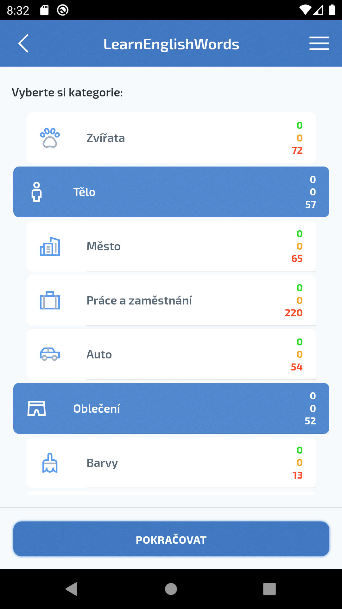
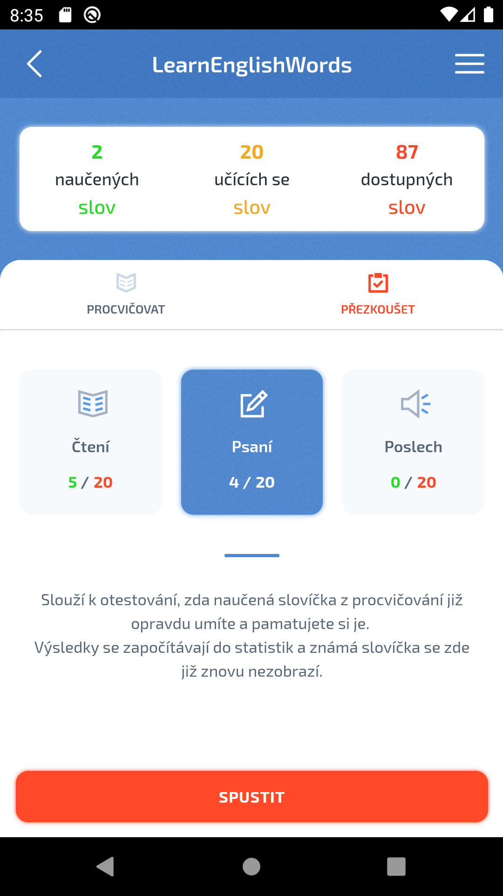
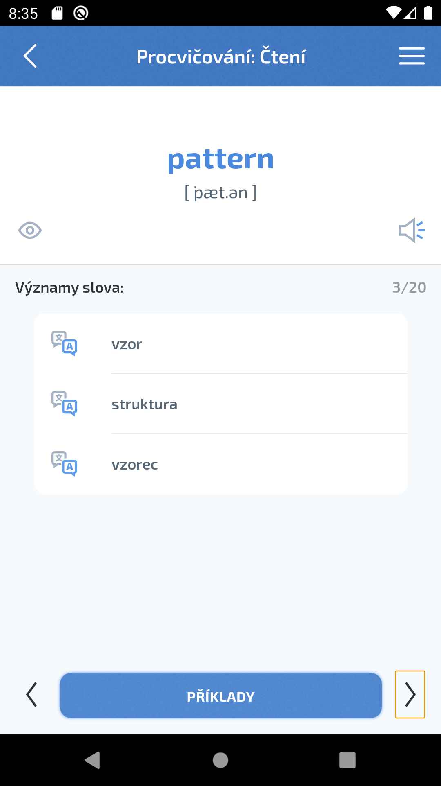

# LearnEnglishWords

A mobile and web application for learning English vocabulary through interactive training modes.

## About

LearnEnglishWords helps users expand their English vocabulary using three training modes: **reading**, **writing** (quiz), and **listening**. Words are organized into collections (basic, intermediate, advanced) and categories. The app tracks learning progress and uses a spaced repetition system to move words through stages: unknown → learning → known → already known.

## Features

- Three training modes: read, write (quiz), listen
- Word collections with multiple difficulty levels
- Category-based word organization
- Progress tracking and statistics
- Audio pronunciation (UK/US)
- Built-in translation
- Dark mode support
- Localization (English, Czech)
- Available on Web, Android (Google Play), and iOS (App Store)

## Screenshots

  
  
  

## Tech Stack

- [Svelte](https://svelte.dev/) — UI framework
- [Framework7](https://framework7.io/) — mobile UI components
- [Apache Cordova](https://cordova.apache.org/) — native mobile builds
- [Webpack](https://webpack.js.org/) — bundler
- [localForage](https://localforage.github.io/localForage/) — offline storage

## Installation

See [INSTALLATION.md](INSTALLATION.md) for detailed setup and build instructions.

## Links

- Web: https://learn-english-words.net
- Google Play: https://play.google.com/store/apps/details?id=eu.learn.english.words
- App Store: https://apps.apple.com/us/app/id1529433124

## Author

**Martin Jablečník**

- Email: info@learn-english-words.net

## License

This project is licensed under the [GNU General Public License v3.0](LICENSE).
